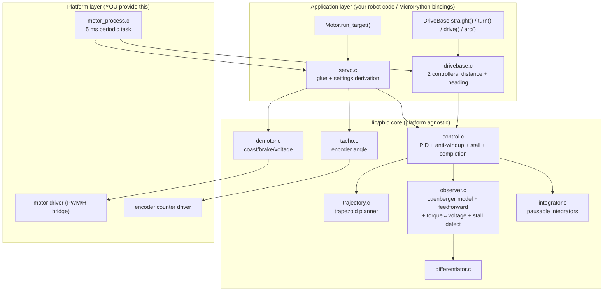

# Porting the Pybricks Motor & DriveBase Control Strategy

A complete dissection of the closed-loop motor/servo/drivebase control stack in
`lib/pbio`, written as a porting guide for reimplementing the same behavior in
another project (any language, any MCU/RTOS).

---

## 1. What you are porting (TL;DR)

Pybricks achieves its motion quality through **five cooperating ideas**, in
order of importance:

1. **A fixed 5 ms control loop** that always runs the same sequence:
   read encoders → update state observer → evaluate trajectory → PID →
   add model-based feedforward → convert torque to voltage → actuate.
2. **A trapezoidal trajectory generator** that pre-computes a time-parameterized
   reference (position/speed/acceleration), so the PID chases a *moving,
   physically feasible target* instead of a step.
3. **A Luenberger state observer** (angle/speed/current motor model) that
   produces a clean speed estimate for the D-term, detects stalls by comparing
   model vs. reality, and provides feedforward torque plus torque↔voltage
   conversion.
4. **PID with anti-windup by pausing time**: when the motor is blocked, the
   trajectory clock and integrators are *paused* instead of accumulating error.
5. **DriveBase = two decoupled controllers** (distance and heading) computed
   from the *average* and *half-difference* of the two wheel encoders, then
   recombined as left = distance + heading, right = distance − heading.

Everything else (gear ratios, unit scaling, stop behaviors, synchronization of
the two wheel trajectories) is plumbing around these five ideas.

---

## 2. Architecture map



### File map (read in this order)

| File | Role |
|---|---|
| `lib/pbio/src/motor_process.c` | The 5 ms scheduler loop |
| `lib/pbio/src/dcmotor.c` + `include/pbio/dcmotor.h` | Raw actuation: coast / brake / voltage |
| `lib/pbio/src/tacho.c` | Encoder → `pbio_angle_t` (mdeg, non-wrapping, 64-bit-ish) |
| `lib/pbio/src/angle.c` | Wrap-safe angle math (`{rotations, millidegrees}`) |
| `lib/pbio/src/differentiator.c` | Numeric speed from encoder (cross-check) |
| `lib/pbio/src/observer.c` | Motor model, speed estimation, stall, feedforward, torque→voltage |
| `lib/pbio/src/motor/servo_settings.c` | **Per-motor model constants (auto-generated)** |
| `lib/pbio/doc/control/motor_model.py` | SymPy script that generates those constants |
| `lib/pbio/src/trajectory.c` | Trapezoidal profile planner/evaluator |
| `lib/pbio/src/integrator.c` | Pausable integrators (anti-windup state) |
| `lib/pbio/src/control.c` | The PID core, completion & stall logic |
| `lib/pbio/src/control_settings.c` | Unit scaling & user-tunable settings |
| `lib/pbio/src/servo.c` | Servo = dcmotor + tacho + observer + control |
| `lib/pbio/src/drivebase.c` | DriveBase = 2 servos + 2 controllers |
| `lib/pbio/src/parent.c` | Stop-propagation (dcmotor→servo→drivebase) |
| `pybricks/common/pb_type_motor.c`, `pybricks/robotics/pb_type_drivebase.c` | Python bindings (reference for API semantics) |

---

## 3. Timing, units, and scaling — get these right first

Most of the code's numerical safety comes from strict unit conventions. Port
them verbatim unless you enjoy debugging overflow.

### 3.1 Clock

- Control loop period: **`PBIO_CONFIG_CONTROL_LOOP_TIME_MS` = 5 ms** (`include/pbio/config.h`).
- Control time base: **100 µs ticks** (`pbdrv_clock_get_100us()`); 10 ticks per ms (`PBIO_TRAJECTORY_TICKS_PER_MS`).
- The scheduler (`motor_process.c`) *increments* the next deadline instead of
  re-arming from "now" (`timer.start += 5`), so the average rate stays exact
  even if one iteration is late. If it falls so far behind that the deadline is
  already past, it bumps by +1 ms until in the future to avoid 0-length cycles.

### 3.2 Units

| Quantity | Unit used in control core | Notes |
|---|---|---|
| Position | millidegrees (mdeg) at **motor shaft** | `pbio_angle_t = {int32 rotations, int32 mdeg}` so it never wraps |
| Speed | mdeg/s | …but *inside trajectory.c* it's decidegrees/s (ddeg/s) to keep int32 math bounded |
| Acceleration | mdeg/s² (deg/s² inside trajectory.c) | |
| Torque (actuation) | µNm (micro Newton·meters) | `1000 µNm` per app unit in `pbio_control_settings_actuation_app_to_ctl` |
| Voltage | mV | |
| Current | 0.1 mA (10000 = 1 A) | |
| Time | 100 µs ticks | |

### 3.3 The one scaling constant: `ctl_steps_per_app_step`

Every controller converts between *application units* (deg at gear output, mm
of travel, deg of robot heading) and *control units* (mdeg at motor shaft) via
a single integer:

```
control_units = app_units × ctl_steps_per_app_step
```

- **Single servo**: `ctl_steps_per_app_step = gear_ratio`
  (mdeg of motor per 1 deg of output; e.g. gear ratio 5 → 5000).
- **DriveBase distance**: `motor_ctl_steps × (360000/π) / wheel_diameter_um`
  (motor mdeg per 1 mm of travel; `ROT_MDEG_OVER_PI = 114592`).
- **DriveBase heading**: `motor_ctl_steps × axle_track_um / wheel_diameter_um`
  (motor mdeg per 1 deg of robot rotation).

Both DriveBase formulas assume wheel diameter and axle track are given in **µm**
and both motors have identical gearing (checked at setup).

---

## 4. Layer dissections

### 4.1 `dcmotor` — the bottom of the stack

Three actuation modes (`pbio_dcmotor_actuation_t`):

- `COAST` — H-bridge idle, motor floats.
- `BRAKE` — implemented as `set_voltage(0)` (short windings / slow-decay).
- `VOLTAGE` — apply mV (clamped to `max_voltage`, mapped to PWM duty by driver).
- `TORQUE` — *never reaches the driver*; `servo.c` converts torque→voltage via
  the observer model before calling `pbio_dcmotor_set_voltage`.

**Battery voltage compensation (easy to miss, performance-critical):**
`pbio_dcmotor_set_voltage` does NOT map voltage to duty against a fixed rail.
It divides by a *moving average of the measured battery voltage*
(`pbio_battery_get_duty_from_voltage` in `battery.c`):

```
duty = voltage_mV × PBIO_BATTERY_MAX_DUTY / battery_voltage_avg_mV
```

A background process updates that average every control tick (scaled by 1024
to reduce rounding error). This is what makes speed and torque consistent from
a full battery down to an empty one. If you skip it, every gain and the
feedforward model silently scale with battery charge.

**Porting requirement:** a driver that can set duty cycle (signed), coast, and
brake, plus a battery voltage ADC reading. No current sensing is required
(current is *estimated* by the observer).

### 4.2 `tacho` + `angle` — position feedback

- Encoder counts are converted to mdeg at the motor shaft and accumulated into
  `pbio_angle_t {rotations, millidegrees}` — a non-wrapping "long" position.
- All position differences use `pbio_angle_diff_mdeg(a,b)` which is wrap-safe
  and returns plain int32 mdeg.
- Direction convention is normalized here (`pbio_direction_t` flips sign in
  one place, so all control code assumes positive = "forward").

**Porting requirement:** quadrature/encoder counter readable at ≥ 1 kHz
effective sampling (it's read every 5 ms), with enough resolution (LEGO motors
are 360 counts/rev). Normalize direction at the driver boundary.

### 4.3 `observer` — the secret sauce (`observer.c`)

A 3-state discrete motor model, stepped **after** each control update with the
*voltage actually applied*:

```
x = [angle_mdeg, speed_mdeg_per_s, current_0.1mA]
x(k+1) = A·x(k) + B·[voltage, external_torque]     (A,B precomputed per motor)
```

Implementation details that matter:

- The A/B coefficients are stored **pre-scaled as integers**
  (`d_angle_d_speed`, `d_speed_d_voltage`, …) in
  `lib/pbio/src/motor/servo_settings.c`, generated offline by
  `lib/pbio/doc/control/motor_model.py` from physical parameters
  (inertia `In`, resistance `R`, inductance `L`, back-EMF `Ke`, torque
  constant `Kt`) using a matrix-exponential discretization.
- **Model correction (Luenberger):** the model is driven by
  `applied_voltage + feedback_voltage`, where feedback voltage is a piecewise
  linear function of the *estimation error* (measured angle − model angle):
  low gain below `feedback_gain_threshold` (20 deg), ~7× higher gain above.
  This keeps the model glued to reality without jitter.
- **Coulomb friction** `torque_friction` is injected as known load, linearly
  faded to zero below `coulomb_friction_speed_cutoff` (500 mdeg/s) to avoid
  chattering at standstill; if speed crosses zero in a step, the friction
  contribution is subtracted back out.
- **Stall detection:** stalled when (a) speed < `stall_speed_limit` (20 deg/s),
  (b) model is *ahead* of reality (feedback pushing back), (c) the push-back
  exceeds `feedback_voltage_stall_ratio` (75 %) of applied voltage, and
  (d) applied voltage is above friction-negligible threshold. Stall must
  persist `stall_time` (200 ms) before reported. **Note: this observer-based
  detector is only the *fallback*** — `pbio_servo_is_stalled` uses it only
  when no controller is active (raw voltage/duty driving). While a controller
  runs, the integrator-based stall detector of §4.5 is used instead; coasting
  motors are never reported stalled.
- **Feedforward torque** (this is why Pybricks tracking is so crisp):

```
τ_ff = (torque_friction/2)·sign(ω_ref)            # friction
     + PRESCALE_SPEED·ω_ref / d_torque_d_speed    # back-EMF compensation
     + PRESCALE_ACCEL·α_ref / d_torque_d_acceleration  # inertia
```

- **Torque → voltage** for actuation: `V = PRESCALE_TORQUE·τ / d_voltage_d_torque`.

**Porting requirement (minimal):** if you don't want the full observer, you can
replace it with (a) a filtered numeric differentiator for speed, (b) a simpler
stall rule (speed ≈ 0 while duty ≈ max for T ms), (c) feedforward
`V_ff ≈ Ke_comp·ω_ref + Ka·α_ref + friction·sign(ω)` in *voltage* units
directly. You lose current estimation and the elegant stall detector, but
tracking quality stays close. If you do port the observer, generate constants
with `motor_model.py` — do not hand-tune the 17 integers.

**Sample-time coupling:** the generated model constants are a matrix-exponential
discretization *at the 5 ms loop period*. If you change the loop frequency you
MUST regenerate the constants (and the `PRESCALE_*` factors), and also revisit
the differentiator window size and the `pid_average` low-pass constant, both of
which embed `PBIO_CONFIG_CONTROL_LOOP_TIME_MS`.

### 4.4 `trajectory` — the reference generator (`trajectory.c`)

A maneuver is precomputed as three phases with boundary knots
`(t1, t2, t3)` times and `(th1, th2, th3)` positions:

```
speed
  │      w1 (peak/target)
  │       ____________
  │      /            \
  │  w0 /              \ w3 (0, or target if "continue")
  │   /                 \
  └─┬──────┬──────────┬──┬──► time
    0  t1  t2         t3
       a0>0      a2<0 (decel)
```

- `pbio_trajectory_new_angle_command()` builds a position maneuver:
  - Direction is folded away (compute forward, then `reverse_trajectory()`).
  - Initial speed `w0` is *clamped* to what can actually be dissipated within
    the available distance (quadratic feasibility checks, `bind_w0()`).
  - If accel and decel ramps intersect before reaching target speed, the
    profile becomes a triangle (`th1 == th2`) — handled explicitly.
  - `continue_running` keeps end speed `w3 = w_target` instead of 0
    (used for "run forever"/`CONTINUE` completion).
- `pbio_trajectory_new_time_command()` builds a speed-over-time maneuver
  (accelerate to speed, hold, optionally decelerate at end of duration).
- `pbio_trajectory_get_reference(trj, t)` → `(position, speed, acceleration)`
  at time `t`. Mostly pure evaluation — **with one side effect:** after t3
  the reference continues at `w3` forever, and once a maneuver has run longer
  than `PBIO_TRAJECTORY_DURATION_FOREVER_MS` (5 minutes), the trajectory is
  transparently **rebased** to a constant-speed maneuver starting at the
  current point. This keeps the `time − t1` subtractions overflow-free for
  infinite maneuvers. Your port needs this rebase (or equivalent clamping) or
  "run forever" breaks after ~5 minutes.
- **`pbio_trajectory_stretch(follower, leader)`** — DriveBase essential:
  recomputes the follower's `w1, a0, a2, th1, th2` so it covers the *same
  distance* but finishes at the *leader's* `t1/t2/t3`. This is how straight()
  and the implicit turn stay synchronized (wheels arrive together).

**Numerical guardrails to copy:** speeds capped at 20000 ddeg/s, accel at
20000 deg/s², single-maneuver angle ≤ INT32_MAX/2 mdeg, all divisions are
custom (`div_w2_by_a` etc.) that keep `(w²)/(2a)`-style expressions inside
int32.

### 4.5 `integrator` — pausable integrators (`integrator.c`)

Both integrators support **pause/resume without state loss**:

- *Position integrator* (position control): integrates position error over
  time; while paused, it also *freezes the trajectory clock*
  (`pbio_position_integrator_get_ref_time()` returns
  `now − total_paused_time`). So a blocked motor doesn't run away from its
  reference — time literally stands still for it.
- *Speed integrator* (timed/speed control): integrates *speed error* into a
  position-like quantity. Pausing freezes the accumulated value; the live
  reference position is corrected by the frozen integral so the speed loop
  effectively becomes PD on a reference that "waits" under load.

Exact position-integrator rules (`pbio_position_integrator_update`) — these
are easy to get subtly wrong, so port them verbatim:
1. **Shrink-while-paused:** updates that *decrease* the integral magnitude are
   always applied, even while paused. Only growth requires the trajectory to
   be running. (So "pause" freezes the trajectory clock, but the integral can
   still unwind.)
2. **Engagement band:** the integral only *grows* while the remaining
   target error is within a band:
   `integral_deadzone ≤ |target_error| ≤ 2 × actuation_max / pid_kp` —
   i.e., not too close to the target (deadzone, 8 deg) and not too far
   (beyond twice the P-saturation range the P-term alone is at max anyway).
   Decreasing updates ignore the band.
3. **Rate limit:** per-sample growth is capped at `integral_change_max`
   (re-evaluated after clamping, since clamping may flip growth into decay).
4. **Total clamp:** integral magnitude never exceeds `actuation_max / pid_ki`,
   so the I-term alone can never command more than full actuation.
5. **Stall condition (position mode):** `(paused OR integral fully saturated)
   AND speed < stall_speed_limit` sustained for `stall_time`. Note the
   saturation clause — a motor grinding at max integral while still running
   the trajectory also counts toward stall.
- Speed integrator stall: paused AND speed below `stall_speed_limit` for
  longer than `stall_time`.

### 4.6 `control` — the PID core (`control.c`)

One `pbio_control_t` instance = one controlled axis. Two controller types:

| | `PBIO_CONTROL_TYPE_POSITION` | `PBIO_CONTROL_TYPE_TIMED` |
|---|---|---|
| Used for | run to angle, hold, DriveBase straight/turn | run for time / forever |
| Loop structure | PID on position | PI on speed, *implemented as* PD on a pausing position reference |
| Integrator | position integrator | speed integrator |
| Completion | time done AND (speed & position within tolerances, or passed target if end speed ≠ 0) | duration elapsed |

**Per-iteration algorithm** (`pbio_control_update`), verbatim order:

```
1. ref = trajectory.evaluate(ref_time)          # ref_time pauses when stalled
2. position_error = ref.position − measured_position        # measured (encoder)
   speed_error    = ref.speed    − estimated_speed          # observer!
3. integral_error = integrator.update(position_error, target_error)
4. kp = dynamic_kp(position_error, target_error, |cmd_speed|)   # see below
   torque = kp·pe + ki·ie + kd·se            (gains scale: mul_by_gain → uNm)
   torque = clamp(torque, actuation_max_temporary)
5. Anti-windup: if |P-term| ≥ actuation_max + kp·2·dt·|speed|
   AND not a legitimate reversal → pause integrator AND (position mode) trajectory clock
6. stalled  = integrator-based stall check
   complete = per-type completion check (table above)
7. Actuate: TORQUE(torque) if not complete or active completion;
   else COAST/BRAKE (or start a HOLD at current position for timed maneuvers)
```

**Dynamic kp** (`pbio_control_get_pid_kp`) — a subtle but important detail:
at low command speeds the effective kp is reduced piecewise-affinely for small
errors (smoother, quieter), with the constraint that the gain is always high
enough that *maximum actuation is reached at the position-tolerance boundary*
— so the motor can never stall out short of the target from insufficient gain.
DriveBases disable this and use the reduced kp throughout
(`pid_kp_low_pct = 0` handling in `drivebase_adopt_settings`).

**Completion actions** (`pbio_control_on_completion_t`):
`COAST`, `BRAKE`, `HOLD` (start position control at endpoint), `CONTINUE`
(keep end speed), and the **smart** variants `COAST_SMART`/`BRAKE_SMART`:
hold *actively* for `smart_passive_hold_time` (100 ms) after completion, then
go passive **and make the endpoint the origin of the next relative maneuver**.
This eliminates error accumulation across sequences of relative moves — a big
part of why chained Pybricks motions are accurate. Port this; it's cheap.

Exact smart-resume mechanics (`pbio_control_start_position_control_relative`):
the next relative target is computed as *previous trajectory endpoint +
increment* (not *measured position + increment*) when **both** of these hold:
1. the previous command used a smart completion mode, and
2. the measured position is still within `2 × position_tolerance` of that
   endpoint.
Additionally, when re-commanding *during* an active maneuver and the new
trajectory is tangent to the ongoing one (same `a0`), the new trajectory is
rebuilt starting from the last *vertex* of the old one instead of the current
reference point — this avoids rounding-error accumulation in tight command
loops. (Drivebases pass `allow_trajectory_shift = false`; single-motor
`run_target`/`run_angle` allow it.)

### 4.7 `servo` — glue + default settings (`servo.c`)

Per 5 ms tick (`pbio_servo_update`):

```
state = {measured angle (tacho), numeric speed (differentiator),
         observer estimated angle & speed}
if control active:
    control_update(...) → feedback_torque
    ff_torque = observer.feedforward(ref.speed, ref.acceleration)
    total = clamp(feedback_torque + ff_torque, actuation_max_temporary)
    dcmotor.set_voltage(model.torque_to_voltage(total))
observer.update(measured_angle, applied_voltage)
```

**Settings derivation** (`pbio_servo_initialize_settings`) — the tuning
philosophy, all derived from one user-facing number, `precision_profile`
(≈ position tolerance in deg):

```
pid_kp = nominal_torque / precision_profile     # P saturates exactly at tolerance
pid_ki = pid_kp / 2                              # I saturates in ~2 s at tolerance
pid_kd = nominal_torque / default_precision / 8  # fixed kp:kd ratio, motor-specific
actuation_max = torque at max rated voltage
speed_max     = rated max speed (per-motor constant)
```

Takeaway: **gains are derived from the motor's torque constant and the desired
tolerance, not hand-tuned.** When porting, keep this derivation so user tuning
stays one-dimensional.

(Footnote: `pbio_servo_override_settings` applies fixed fractional gain
reductions for the legacy EV3/NXT motors only — e.g. EV3 Medium gets
kp/3, ki/2, kd/10. The modern Powered Up motors use the pure derivation
above, which confirms the formulas are the real tuning, not the exception.)

### 4.8 `drivebase` — sum & difference control (`drivebase.c`)

The heart of it:

```
state_distance = (left + right) / 2        # average  → robot translation
state_heading  = (left − right) / 2        # half-difference → robot rotation
```

Two independent `pbio_control_t` controllers run on these virtual axes, then:

```
left_torque  = distance_torque + heading_torque + ff_left(ref_dist + ref_head)
right_torque = distance_torque − heading_torque + ff_right(ref_dist − ref_head)
```

Key behaviors to replicate:

1. **Settings adoption** (`drivebase_adopt_settings`): every limit/gain takes
   the *minimum* of the two motors (weakest-motor-wins), accel/decel scaled by
   ¾ for smoothness, `ki = 0` (no integral needed — no constant disturbance on
   a chassis), and **`heading.actuation_max = 2 × distance.actuation_max`** so
   that under saturation the heading controller "wins" — the robot turns
   correctly even at the cost of distance accuracy. This priority trick is
   essential for good path shape.
2. **Trajectory synchronization**: after starting both controllers, the shorter
   trajectory is `pbio_trajectory_stretch()`-ed to the leader's duration → both
   axes finish simultaneously → straight lines stay straight.
3. **Pause coupling**: if either controller anti-windup-pauses, both pause
   (`db->control_paused`). If either requests coast/brake, the whole drivebase
   stops that way.
4. **Gyro option**: heading *position and speed measurement* can come from an
   IMU (`pbio_drivebase_set_use_gyro`), but the derivative term still uses the
   motor-based speed estimate to preserve loop stability. Heading offset/reset
   is handled by the IMU module in that mode.
5. **Geometry helpers**: arc length `= radius·angle` with the constant
   `573 ≈ 10·180/π` (`(10 * angle * radius) / 573`); absolute turns wrap the
   target to the equivalent angle within ±180° of current heading *before*
   scaling, preserving the exact user-specified degree target.
6. **Stop propagation** (`parent.c`): any direct motor command while a
   DriveBase is active stops the DriveBase and coasts the other motor —
   prevents one motor fighting a chassis controller.

---

## 5. The complete per-tick algorithm (pseudocode)

```
every 5 ms:
    for each drivebase:               # BEFORE servos
        if active:
            sd, sh = read_both_servo_states()          # avg & half-diff
            (ref_d, τ_d, pause_d) = control_update(distance_ctl, sd)
            (ref_h, τ_h, pause_h) = control_update(heading_ctl, sh)
            control_paused = pause_d or pause_h        # coupled anti-windup
            if either says coast/brake: stop_whole_drivebase(); continue
            τ_L = τ_d + τ_h + ff(ref_d.speed+ref_h.speed, ref_d.accel+ref_h.accel)
            τ_R = τ_d − τ_h + ff(ref_d.speed−ref_h.speed, ref_d.accel−ref_h.accel)
            actuate(L, τ_L); actuate(R, τ_R)

    for each servo:                              # ALL servos, incl. drivebase-owned
        state = read_state()                   # position: encoder; speed: differentiator;
                                               # estimates: observer
        if control active:                     # false for drivebase-owned servos —
                                               # the drivebase already actuated them
            (ref, τ_fb, _) = control_update(ctl, state)
            τ = clamp(τ_fb + ff(ref.speed, ref.accel))
            actuate(servo, τ)
        observer.update(measured_angle, applied_voltage)   # ALWAYS runs, so the
                                                           # drivebase gets fresh
                                                           # estimates next tick
```

`control_update(ctl, state)`:

```
ref = trajectory.evaluate(integrator.ref_time(now))     # clock pauses when stuck
pe = ref.pos − state.position          # measured
se = ref.speed − state.speed_estimate  # observer
ie = integrator.update(pe, target_pe)
kp = dynamic_kp(pe, target_pe, |ref.speed_cmd|)
τ  = clamp(kp·pe + ki·ie + kd·se, τ_max)
if |kp·pe| ≥ τ_max + kp·2·dt·|speed| and not reversing:
    integrator.pause()      # freezes integral AND (position mode) ref clock
else:
    integrator.resume()
stalled  = paused_too_long and |speed| < stall_speed_limit
complete = <per-type check, section 4.6>
if complete and passive completion: actuate coast/brake; deactivate
elif complete and timed+hold: start hold at current position
else: output τ
```

---

## 6. Step-by-step porting plan

### Phase 0 — Platform HAL (1–2 days)
1. Provide a monotonic 100 µs clock (or tick conversion macros).
2. Provide a 5 ms periodic task with *deadline-increment* scheduling (§3.1).
3. Motor driver: `set_voltage(mV)` (signed → PWM duty), `coast()`, brake =
   voltage 0. One `max_voltage` per port.
4. Encoder driver: cumulative counts, direction-normalizable, convertible to
   mdeg at the motor shaft.

### Phase 1 — Single motor fidelity (core value)
5. Port `angle.c` (trivial) and `int_math.c` helpers (`mult_then_div`,
   `clamp`, `sign`).
6. Port `trajectory.c` **exactly** — including the decidegrees internal units
   and the feasibility clamps. It's self-contained and unit-tested in
   `lib/pbio/test/` (run that test suite against your port!).
7. Port `integrator.c` then `control.c`. Keep the pausing semantics.
8. Choose observer strategy (§4.3): full Luenberger (recommended if you can
   run `motor_model.py`) or the simplified differentiator+feedforward fallback.
9. Port `servo.c` glue and the settings derivation formulas (§4.7).
10. Validate: step responses, run_target accuracy, hold stiffness, stall
    detection with your hand blocking the motor.

### Phase 2 — DriveBase
11. Port `drivebase.c`: state avg/half-diff, two controllers, torque
    sum/difference, settings adoption with heading 2× priority, trajectory
    stretch, coupled pausing, stop propagation.
12. Optional: gyro heading override.
13. Validate: straight-line drift over 2 m, turn accuracy over 10×360°,
    arc radius accuracy, chained relative moves without reset (smart-stop
    benefit).

### Phase 3 — Polish
14. Data logging (`logger.c`) — invaluable for tuning; the control loop already
    emits a 12-column row per tick.
15. User-facing settings API (`control_settings.c`): PID, tolerances, stall,
    actuation limit, trajectory limits.

---

## 7. Minimal viable port (if time is short)

You can capture ~90 % of the behavior with:

- 5 ms loop, encoder read + filtered differentiator speed.
- Trapezoidal trajectory planner with per-axis stretch for two axes.
- PID: `τ = kp·pe + ki·ie + kd·se` with the *pausing* anti-windup and the
  completion checks. Skip dynamic kp (use fixed kp), skip ki for drivebase.
- Feedforward as voltage: `V_ff = kEMF·ω_ref + kAccel·α_ref + kFric·sign(ω)`,
  tuned by hand (measure: `kEMF ≈ max_voltage / max_measured_speed`).
- DriveBase: avg/half-diff axes, torque split, heading actuation priority 2×,
  stretch sync.
- Smart stops (100 ms active hold before passive; relative moves resume from
  endpoint).

Skip: Luenberger observer, current estimation, observer-based stall (use
"speed < threshold while duty ≈ max for 200 ms"), torque units (work in mV
throughout).

---

## 8. Pitfalls & gotchas (learned from the code)

1. **Integer overflow is the #1 porting bug.** The code is carefully crafted
   so intermediate results fit int32 *given its unit choices*. If you change
   units (e.g. µdeg instead of mdeg) you *will* overflow `w²/2a` terms. Copy
   the units in §3.
2. **Don't evaluate the trajectory at wall-clock time.** Always use the
   integrator-compensated reference time, or blocked motors will wind up
   error faster than any anti-windup can contain.
3. **D-term must use the observer/estimated speed**, not raw differentiation —
   5 ms sampling of a 360-count encoder is too coarse otherwise.
4. **Feedforward is not optional** for good tracking; without it the
   integrators do all the work and you'll see lag, overshoot at ramp ends, and
   poor DriveBase path shape.
5. **Heading priority under saturation** (2× actuation) is what keeps arcs
   circular when the battery is low. Don't set them equal.
6. **Always stretch the shorter trajectory** after starting a two-axis
   maneuver; otherwise straights become curves.
7. **Completion ≠ stopping.** For active completions (HOLD/CONTINUE) the
   controller keeps actuating after "done"; your blocking/await logic must key
   off the `COMPLETE` flag, not off actuation stopping.
8. **Relative moves after smart stops must start from the previous reference
   endpoint**, not the freshly measured position — that's the whole point
   (drift elimination). `control.c` does this by restarting trajectories from
   `pbio_control_get_reference()` while control is still active during the
   smart-hold window.
9. **Brake is `set_voltage(0)`** — if your H-bridge distinguishes
   slow-decay/brake from coast, wire brake accordingly.
10. **Reset order matters on angle reset:** stop control → reset tacho → reset
    observer, then re-apply stop mode if control was active (`servo.c`
    `pbio_servo_reset_angle`).
11. **Weakest-motor-wins settings adoption** prevents asymmetric behavior when
    mixing motor types; also verify identical gear ratios at DriveBase setup
    or distance/heading scaling will be silently wrong.
12. **Keep the loop period in the filters as constants, not runtime math**:
    e.g. `pid_average` low-pass uses `PBIO_CONFIG_CONTROL_LOOP_TIME_MS`
    directly; changing loop rate without updating these constants detunes
    everything subtly. (Same for the observer model constants — see §4.3.)
13. **Tick arithmetic must be wrap-safe.** The 100 µs `uint32` clock wraps
    after ~119 hours. All deadline comparisons use signed subtraction
    (`pbio_util_time_has_passed`-style: `(int32_t)(deadline − now) <= 0`),
    never `now >= deadline`.
14. **Duty cycle is battery-compensated** (see §4.1). Without it, identical
    commands produce different torque at different charge levels — and your
    feedforward/observer (which assume voltage means volts) will be wrong by
    the battery ratio.
15. **The observer update uses the voltage *actually applied* this tick**,
    including the clamp to `max_voltage`. Feeding it the *requested* torque
    instead of the applied voltage corrupts the speed estimate exactly when
    saturated — which is when stall detection matters most.
16. **Encoder counts must be accumulated in a wide integer at the driver
    level** (e.g. int32 edge-counting ISR, 1 count/deg on LEGO hardware), and
    the tacho layer applies zero-offset and direction on top. If you expose a
    raw 16-bit hardware counter to the control layer, unwrap it by polling
    much faster than the max wrap time before handing it to tacho.
17. **The trajectory evaluator has a mutation side effect** (the 5-minute
    rebase, §4.4). Don't assume `get_reference` is callable from multiple
    readers or threads — the control loop is its only caller by design.

---

## 9. Motor model identification (for the full observer)

Run `lib/pbio/doc/control/motor_model.py` / `motor_data.py` with your motor's
physical parameters (inertia, R, L, Ke, Kt, friction torque) to generate the
17 integer constants of `pbio_observer_model_t` plus `torque_friction`.
Practical identification without instruments:

- `d_torque_d_speed` ↔ back-EMF slope: measure no-load speed at known voltage.
- `d_torque_d_acceleration` ↔ inertia: spin-up time with known voltage step.
- `torque_friction`: minimum voltage to *just* start moving, converted to torque.
- Defaults from a similar LEGO motor (e.g. `model_technic_m_angular`) are a
  decent starting point for same-class motors.

---

## 10. Validation assets already in this repo

- `lib/pbio/test/` — unit tests for trajectory, control, integrator, observer
  math. Build with `make -C lib/pbio/test DEBUG=1` (see workspace task
  "build test-pbio"). **Port these tests first; they encode the numerical
  contracts.**
- `lib/pbio/src/control.c` logging block — 12 columns per tick (reference vs
  measured vs estimated, P/I/D terms, stall flags). Reproduce this logging in
  your port before tuning anything.
- `tests/motors/`, `tests/pup/` — MicroPython behavioral tests showing
  expected user-visible semantics.

### 10.1 Test suite location and how to run it

- Test sources: **`lib/pbio/test/`** (`src/test_trajectory.c`,
  `src/test_servo.c`, `src/test_drivebase.c`, `src/test_math.c`,
  `src/test_angle.c`, ...). The drivebase/servo tests run the *real* control
  loop against a **simulated motor** (`lib/pbio/test/drv/motor_driver/
  motor_driver_virtual_simulation.c`) with a fake clock — full behavior,
  no hardware needed.
- Easiest entry point from the repo root: `./test-pbio.sh`
  (add `--list-tests` to enumerate). It builds, then runs
  `lib/pbio/test/build/test-pbio`, and drops results/cores into
  `lib/pbio/test/results/`.
- Manual build: `make -C lib/pbio/test DEBUG=1 -j` (workspace task
  "build test-pbio" wraps this in `poetry run`).

### 10.2 Known build issues (found on a Windows host)

The test harness is **POSIX-only**. On a native Windows shell you will hit:

| Symptom | Cause | Fix |
|---|---|---|
| `make: command not found` / `poetry: command not found` | No build tools on PATH | Install MSYS2/MinGW (`pacman -S make mingw-w64-ucrt-x86_64-gcc`) or use WSL2; install Poetry for the `poetry run` wrapper |
| Compile errors on `unistd.h`, `clock_gettime`, `sys/wait.h` | `test-pbio.c` and friends are POSIX | Build inside **WSL2** (recommended) or MSYS2; not plain MSVC/PowerShell |
| `failed` cloning btstack | `lib/btstack` submodule not checked out | `git submodule update --checkout --init lib/btstack` (the Makefile attempts this automatically) |
| Errors referencing tinytest/lwrb/lego headers | Other submodules missing | `git submodule update --init --recursive` |
| Segfault during a test run | — | `test-pbio.sh` already drops you into `gdb -ex backtrace` on the core in `lib/pbio/test/results/` |
| Test hangs | Protothread deadlocked | Set `PBIO_TEST_DEBUG=1`; default timeout is 1 s, override with `PBIO_TEST_TIMEOUT=<s>` |

If setting up a POSIX toolchain is not an option, the pragmatic alternative is
to re-implement the handful of *pure-math* tests (trajectory knot points,
integrator band/clamp rules, angle wrap math) in your own test framework —
those need no OS, no btstack, no protothreads, and they are the tests that
catch transcription bugs.

---

## 13. Debugging guide: symptom → layer → likely cause

When your port diverges, don't tune blindly. Match the symptom, check the
listed layer, and confirm with the §10 log columns (ref vs measured vs
estimated position/speed, P/I/D terms, stall flags, actuation).

| Symptom | Suspect layer | Likely cause (pitfall §8 ref) |
|---|---|---|
| Motor creeps or never quite reaches target | `control` / settings | kp too low at tolerance boundary — check the `pid_kp = nominal_torque / precision_profile` derivation (§4.7) and dynamic-kp floor (§4.6) |
| Oscillation / hunting around target | `observer` speed estimate | D-term fed by noisy raw differentiation instead of observer speed (#3); or encoder resolution too coarse (§12.1) |
| Blocked motor winds up then slams when released | `integrator` | Anti-windup pause missing — trajectory clock keeps running while stalled (#2, §4.5) |
| Error accumulates over chained relative moves | `control` completion | Smart-stop resume not implemented — next move starts from measured position instead of previous endpoint (#8, §4.6) |
| DriveBase "straight" drifts into an arc | `drivebase` | `pbio_trajectory_stretch` not applied — axes finish at different times (#6); or mismatched `ctl_steps_per_app_step` between motors (#11) |
| Arcs/turns distort when battery sags | `drivebase` settings | Heading actuation priority not 2× distance (#5); or battery compensation missing (#14) |
| Torque/speed inconsistent across battery charge | `dcmotor` / `battery` | Duty not divided by battery moving average (#14, §4.1) |
| Stall never detected under load | `observer` | Observer fed *requested* torque instead of *applied* voltage (#15) |
| Stall false-positives while coasting | `servo` | Observer stall detector running on a coasting motor — it must be gated to voltage actuation only (§4.3) |
| `run_forever` glitches after ~5 minutes | `trajectory` | Missing evaluator rebase (`PBIO_TRAJECTORY_DURATION_FOREVER_MS`) (#17, §4.4) |
| Everything breaks after hours of uptime | scheduler / all | Tick comparisons not wrap-safe (`(int32_t)(deadline − now) <= 0`) (#13) |
| Intermittent wild motion, sporadic | `int_math` / units | int32 overflow from changed units (#1) — audit every `w²/2a`-style term |
| Slow periodic wobble in speed holding | scheduler | Loop jitter: re-armed instead of deadline-increment scheduling (§3.1); preempted 5 ms task (§12.4) |
| Absolute turn lands ±1° off repeatedly | `drivebase` geometry | ±180° wrap of the absolute target done *after* scaling instead of before (§4.8.5) |
| Single motor commanded while DriveBase active fights it | `parent` | Stop propagation missing — dcmotor must stop servo, servo must stop drivebase (#6/§4.8.6) |
| Hold after `run_time` ends limp (coasts) | `control` | Timed+HOLD requires starting a new position hold at the *current* position on completion (§4.6 step 7) |
| Near-zero jitter when holding | `observer` | Coulomb friction not faded out below `coulomb_friction_speed_cutoff` (§4.3) |
| Works at first, degrades after angle resets | `servo` | Reset order wrong: must be stop → reset tacho → reset observer → re-apply stop (#10) |

**Generic triage procedure:**
1. Log the 12 control columns around the failure.
2. Compare `ref` (col 6–7) vs measured (2–3) vs estimated (8–9):
   - ref wrong → trajectory layer.
   - ref OK, estimated diverges from measured → observer/encoder layer.
   - estimated tracks measured but actuation wrong → control/PID layer.
   - actuation right at log but wrong at wheels → dcmotor/battery/HAL layer.
3. Reproduce in the ported unit-test harness with the virtual motor before
   touching hardware again.

---

## 11. Porting checklist

```
[ ] 100 µs monotonic clock + 5 ms deadline-increment scheduler
[ ] int_math: mult_then_div (64-bit intermediate), clamp, sign
[ ] angle: non-wrapping {rotations, mdeg} position type
[ ] dcmotor HAL: coast / brake(=0 V) / signed voltage
[ ] tacho: direction-normalized cumulative mdeg at motor shaft
[ ] differentiator: windowed numeric speed
[ ] observer: full model (constants generated) OR simplified fallback
[ ] trajectory: angle & time commands, feasibility clamps, stretch, evaluator
[ ] integrators: pausable, deadzone, rate limit, ref-time freeze
[ ] control: both types, dynamic kp, anti-windup pause, stall, completion,
      all six on-completion modes incl. smart
[ ] servo glue: state read, fb+ff, torque→voltage, settings derivation
[ ] drivebase: avg/half-diff states, two controllers, torque split,
      heading 2× priority, stretch sync, coupled pause, stop propagation
[ ] unit tests from lib/pbio/test passing on target
[ ] logging columns for tuning
[ ] battery voltage moving average + duty compensation
[ ] wrap-safe tick comparisons everywhere
```

---

## 12. What "foolproof" cannot guarantee

The algorithmic stack above is complete and verified against the source. But
performance parity also depends on things no document can transfer:

1. **HAL fidelity** — PWM frequency/resolution, H-bridge deadtime and decay
   mode, encoder resolution and read latency, battery ADC quality. The LEGO
   motors have 360 counts/rev; a much coarser encoder degrades the
   differentiator and completion tolerances.
2. **The mechanical plant** — backlash, wheel slip, flex. The controllers
   assume the encoder measures the thing you care about.
3. **Motor parameter identification** — the observer/feedforward constants
   ship for LEGO motors only; yours need measuring (§9).
4. **Deterministic scheduling** — the original runs in a cooperative
   protothread OS with jitter well under 1 ms. A preempted 5 ms loop detunes
   every time-based constant listed in pitfall 12.
5. **Validation discipline** — port `lib/pbio/test/` first, then tune with the
   logged columns before trusting step response on hardware.

Follow the guide *and* validate against the test suite and logs, and you will
replicate the behavior. Skip validation and you have a lookalike.
